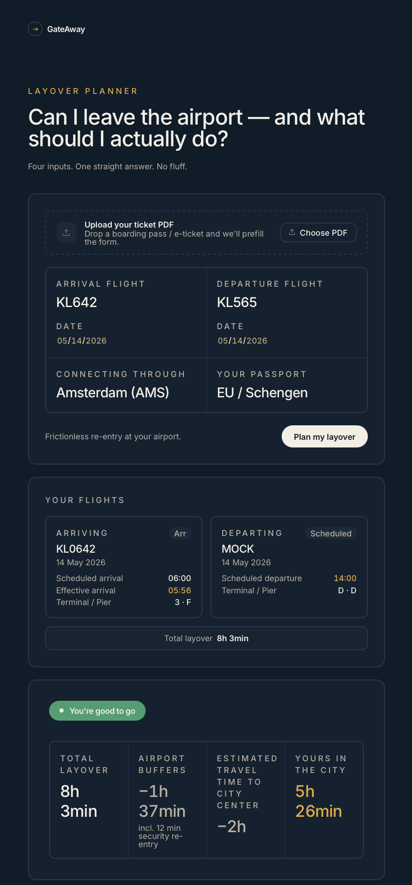
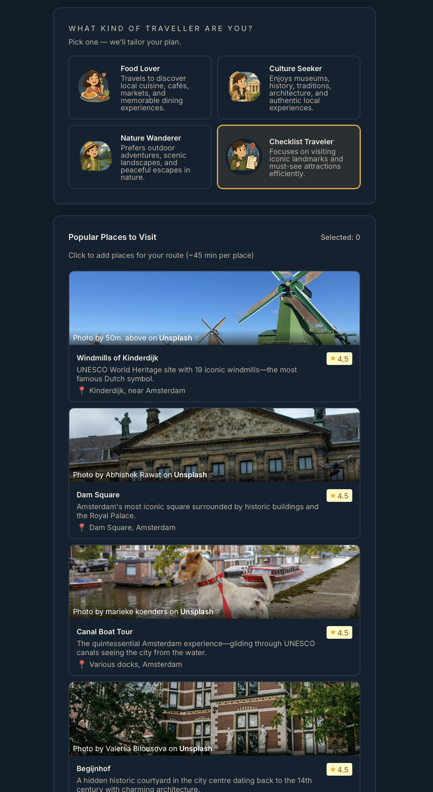
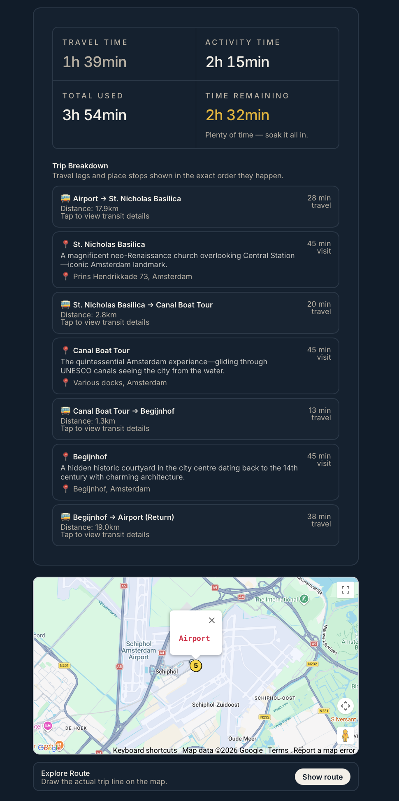

# GateAway Genius

GateAway Genius is a full-stack layover planning platform that helps travelers decide, with confidence, whether they can safely leave the airport during a layover and what to do with the available time.

It combines deterministic time-buffer logic, live travel-time intelligence, and AI-assisted recommendations to deliver practical trip plans with clear safety guidance.

## Table of Contents
- [Project Overview](#project-overview)
- [What We Built](#what-we-built)
- [Core Features](#core-features)
- [How It Works](#how-it-works)
- [Tech Stack](#tech-stack)
- [Architecture](#architecture)
- [API Overview](#api-overview)
- [Screenshots](#screenshots)
- [Local Development](#local-development)
- [Environment Variables](#environment-variables)
- [Deployment](#deployment)
- [Troubleshooting](#troubleshooting)
- [Contributing](#contributing)
- [License](#license)

## Project Overview

Travelers with short layovers often have the same question:

"Can I leave the airport and still make it back on time?"

GateAway Genius answers this by combining:
- flight context,
- airport-specific buffer rules,
- real transport timing,
- and curated place suggestions based on traveler persona.

The result is a safety-first recommendation and an actionable mini-itinerary.

## What We Built

The current version delivers:

1. A responsive web interface for layover input and plan results.
2. A FastAPI backend that computes verdicts and timing breakdowns.
3. Multi-airport support (AMS, LIS, SIN) - Amsterdam Live Waiting Times for Security Checks.
4. Persona-based place suggestions.
5. Route calculation across selected places with map-friendly route output.
6. Feedback capture for quality improvement.
7. Deployable architecture (frontend on Vercel, backend on Render or other cloud runtimes).

## Core Features

### 1) Safety-First Layover Verdict
- Computes whether leaving the airport is safe, tight, or not feasible.
- Uses buffer-aware logic for re-entry, security, and transfer time.
- Keeps the safety decision deterministic (not delegated to the LLM).

### 2) Flight and Timing Breakdown
- Displays inbound and outbound flight context.
- Shows total layover vs airport buffer vs usable city time.
- Provides timeline segments for transparent decision-making.

### 3) Persona-Driven Recommendations
- Supports personas such as Food Lover, Culture Seeker, Nature Wanderer, and Checklist Traveler.
- Returns tailored place options with details such as rating, location, and context.

### 4) Select-and-Plan Route Experience
- Users choose places they want to visit.
- Backend calculates route order and travel legs.
- UI presents itinerary timing and route map data.

### 5) Feedback Loop
- Includes in-app feedback submission.
- Enables iterative product improvement using real user input.

## How It Works

1. User submits layover, flight, and traveler details.
2. Backend evaluates layover feasibility and usable minutes.
3. User picks a travel persona.
4. Backend returns persona-specific places.
5. User selects places and requests route planning.
6. Backend returns detailed route legs and timing summary.

## Tech Stack

### Frontend
- React + TypeScript
- Vite
- Tailwind CSS
- shadcn/ui component set

### Backend
- Python + FastAPI
- Pydantic models
- Service-oriented backend modules

### Integrations
- Google Maps (distance and route support)
- Gemini-based suggestion pipeline
- Airport data providers (Schiphol and AeroDataBox services)

## Architecture

```text
Frontend (React + TypeScript)
   |
   | HTTP (POST/GET)
   v
Backend (FastAPI)
   |- Planner Service (verdict + timeline + buffers)
   |- Places Service (persona-based options)
   |- Route Service (multi-stop routing + legs)
   |- External APIs (airport + maps + AI)
```

## API Overview

### Primary Endpoints
- `GET /health`
- `POST /api/plan`
- `POST /api/places-for-persona`
- `POST /api/calculate-route`
- `POST /api/extract-flights`
- `POST /api/feedback`
- `GET /api/airports`
- `GET /api/airports/{airport_code}`

## Screenshots





## Local Development

### Prerequisites
- Node.js 18+
- Python 3.10+

### 1) Start backend

```bash
cd backend
python -m venv .venv
source .venv/bin/activate  # Windows: .venv\Scripts\activate
pip install -r requirements.txt
python main.py
```

Backend default: `http://localhost:8000`

### 2) Start frontend

```bash
npm install
npm run dev
```

Frontend default: `http://localhost:8080`

## Environment Variables

### Frontend (`.env.local`)

```bash
VITE_API_URL=https://your-backend-domain.up.railway.app
VITE_GOOGLE_MAPS_API_KEY=your_maps_key
```

Important: `VITE_API_URL` must include protocol (`https://` or `http://`).

### Backend (`backend/.env`)

```bash
GOOGLE_GEMINI_API_KEY=...
SCHIPHOL_APP_ID=...
SCHIPHOL_APP_KEY=...
AERODATABOX_API_KEY=...
GOOGLE_MAPS_API_KEY=...
UNSPLASH_ACCESS_KEY=...
DEBUG=True
FRONTEND_URL=https://your-frontend-domain.vercel.app
```

## Deployment

### Frontend (Vercel)
1. Import repository.
2. Set `VITE_API_URL` to your backend public URL.
3. Redeploy after environment updates.

### Backend (Render)
1. Deploy the `backend` service.
2. Configure backend environment variables.
3. Set `FRONTEND_URL` to your Vercel domain.
4. Ensure CORS allows your frontend origin.

## Troubleshooting

### "Could not generate plan" or "Load failed"
- Confirm backend health endpoint is reachable.
- Verify `VITE_API_URL` includes protocol.
- Verify backend CORS includes your Vercel origin.
- Redeploy both frontend and backend after env or CORS changes.

### Frontend builds but API calls fail
- Open browser dev tools and inspect request URL.
- Confirm it points to deployed backend and not localhost.

## Contributing

1. Create a feature branch.
2. Commit with clear messages.
3. Push branch and open a pull request.

## License

MIT
